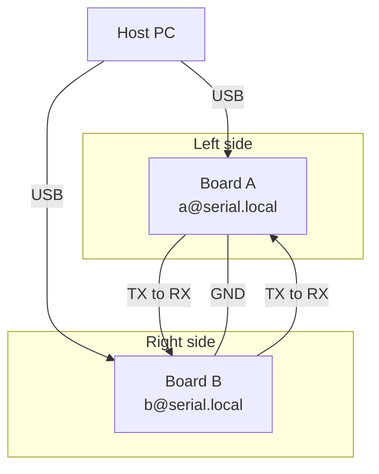

<!--
SPDX-FileCopyrightText: 2026 piyopiyo.ex members

SPDX-License-Identifier: Apache-2.0
-->

# AtomVM serial distributed Erlang サンプル

ESP32 2 台を UART で直結し、AtomVM の serial distributed Erlang を試すための小さなサンプルです。

このサンプルでは、次の動作を確認できます。

- 2 台の ESP32 を `serial_dist` で接続する
- `a@serial.local` と `b@serial.local` のような固定名でノードを起動する
- 各ノードで登録プロセス `:demo` を起動する
- 一方のノードから他方のノードへ `ping` を送り、`pong` を返す

現在は AtomVM `release-0.7` 系の serial distribution 機能を前提にしています。

参考情報:

- AtomVM `release-0.7` の distributed Erlang ガイド
  - https://doc.atomvm.org/release-0.7/distributed-erlang.html

## 対象機材

- AtomVM が対応する `ESP32` 開発ボード 2 台

このリポジトリーでは現在、`atomvm-esp32-elixir.img` と `atomvm-esp32s3-elixir.img` を同梱しています。

## 対象開発環境

本サンプルでは、次の環境を想定しています。

- macOS または Linux
- データ転送に対応した USB ケーブル 2 本
- ジャンパーワイヤー 3 本以上
- Elixir
- `mix` (Elixir プロジェクトのビルドや書き込みに使うコマンド)
- `esptool` (`ESP32` / `ESP32-S3` にイメージを書き込むためのツール)
- `tio` (シリアルログを確認するためのツール)

## 配線

2 台のボードを 1 本の UART で直結します。
各ボードは、書き込みとログ確認のために USB でも個別にホスト PC へ接続したままにします。



- Board A TX -> Board B RX
- Board A RX -> Board B TX
- Board A GND -> Board B GND

このアプリケーションでは、デフォルトで `UART1` を使います。

- TX ピン: `17`
- RX ピン: `16`
- 通信速度: `115200`

ボードや配線に応じて、必要なら環境変数で上書きしてください。

## 使い方

このディレクトリーに移動します。

```sh
cd hello_atomvm_disterl_serial
```

依存関係を取得します。

```sh
mix deps.get
```

このサンプル用の AtomVM イメージがまだ書き込まれていない場合は、先に次を実行してください。
すでに書き込み済みの場合は、この手順は不要です。

このリポジトリーでは現在 `ESP32` 用と `ESP32-S3` 用のイメージを同梱しています。書き込み例は次のとおりです。

ESP32 の例:

```sh
# フラッシュ全体を消去して、まっさらな状態にする
esptool --chip esp32 --port /dev/ttyACM0 erase-flash

# このサンプル用の AtomVM イメージを 0x1000 から書き込む
esptool --chip esp32 --port /dev/ttyACM0 write-flash 0x1000 atomvm-esp32-elixir.img
```

ESP32-S3 の例:

```sh
# フラッシュ全体を消去して、まっさらな状態にする
esptool --chip esp32s3 --port /dev/ttyACM0 erase-flash

# このサンプル用の AtomVM イメージを 0x0 から書き込む
esptool --chip esp32s3 --port /dev/ttyACM0 write-flash 0x0 atomvm-esp32s3-elixir.img
```

これらのオフセットは AtomVM 公式ドキュメントの Getting Started Guide にある bootloader start address に合わせています。

- https://doc.atomvm.org/main/getting-started-guide.html

## 環境変数

### ノード名

| 環境変数 | 説明 |
| -------- | ---- |
| `ATOMVM_NODE_ALIAS` | 自ノードの別名。既定値は `a` |
| `ATOMVM_PEER_ALIAS` | 相手ノードの別名。既定値は、自ノードが `a` のとき `b`、それ以外のとき `a` |

ノード名は `<alias>@serial.local` の形で組み立てられます。

例:

- `a@serial.local`
- `b@serial.local`

### デモ動作

| 環境変数 | 説明 |
| -------- | ---- |
| `ATOMVM_AUTO_PING` | truthy な値を設定すると、起動後に 1 回だけ相手ノードへ `ping` を送る |
| `ATOMVM_PING_DELAY_MS` | 自動 `ping` までの待ち時間。既定値は `1000` ミリ秒 |

### UART 設定

| 環境変数 | 説明 |
| -------- | ---- |
| `ATOMVM_UART_PERIPHERAL` | UART 名。既定値は `UART1` |
| `ATOMVM_UART_SPEED` | 通信速度。既定値は `115200` |
| `ATOMVM_UART_TX_PIN` | TX ピン番号。既定値は `17` |
| `ATOMVM_UART_RX_PIN` | RX ピン番号。既定値は `16` |

## 書き込み例

Board A 側:

```sh
export ATOMVM_NODE_ALIAS=a
export ATOMVM_PEER_ALIAS=b
unset ATOMVM_AUTO_PING
mix atomvm.esp32.flash --port /dev/ttyACM0
```

Board B 側:

```sh
export ATOMVM_NODE_ALIAS=b
export ATOMVM_PEER_ALIAS=a
export ATOMVM_AUTO_PING=true
mix atomvm.esp32.flash --port /dev/ttyACM1
```

接続先は必要に応じて読み替えてください。

例:

- Linux: `/dev/ttyACM0`, `/dev/ttyUSB0`
- macOS: `/dev/cu.usbmodemXXXX`, `/dev/cu.usbserialXXXX`

接続先が分からない場合は、次で確認できます。

```sh
tio --list
```

## 動作確認

別端末で各ボードのシリアルログを開きます。

```sh
tio /dev/ttyACM0
```

```sh
tio /dev/ttyACM1
```

起動に成功すると、各ノードで次のようなログが表示されます。

```text
serial_dist: started
serial_dist: alias a
serial_dist: node :"a@serial.local"
serial_dist: peer :"b@serial.local"
serial_dist: cookie <<"AtomVM">>
serial_dist: uart [{:peripheral, "UART1"}, {:speed, 115200}, {:tx, 17}, {:rx, 16}]
serial_dist: ready
demo: registered process :demo
```

`ATOMVM_AUTO_PING=true` を設定した側では、さらに次のようなログが表示されます。

```text
demo: sending ping to :"a@serial.local"
demo: received pong from :"a@serial.local"
```

相手側では、次のようなログが表示されます。

```text
demo: received ping from :"b@serial.local"
demo: sent pong from :"a@serial.local"
```

期待される動作:

- 2 台のノードがそれぞれ `serial_dist: ready` を表示する
- 自動 `ping` を有効にした側で `pong` を受信する
- 相手側で `ping` を受信したログが表示される
